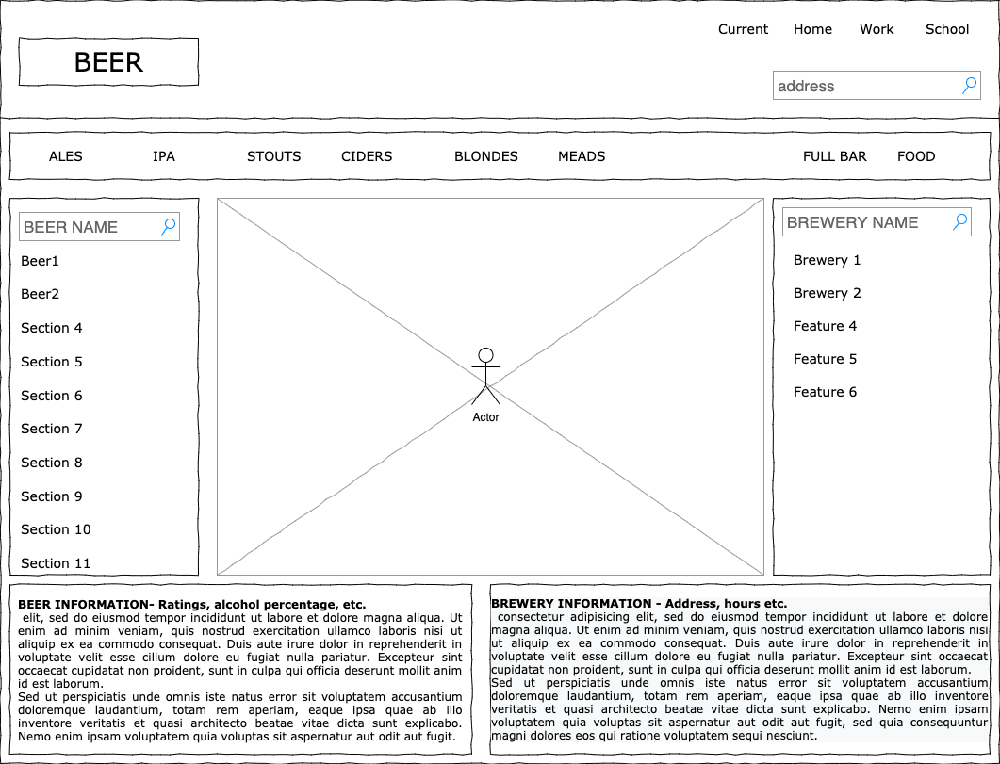

# Project-B
This app allows the user to find breweries using location search, or type of beer (i.e. stout, IPAs, Blondes, etc.,) or rating of beers. Once the user selects  their method  of search, the user will have access to...

## Wireframe - rough draft

The following is our first version of a rough draft wireframe:

